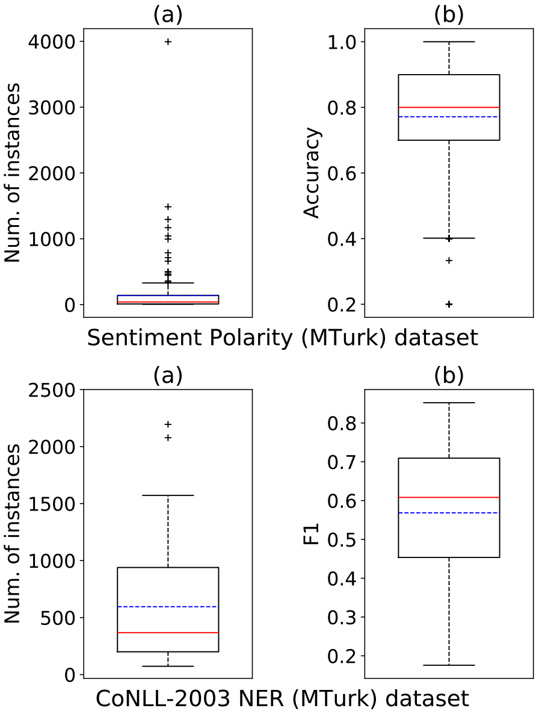

# Learning from Noisy Crowd Labels with Logics

Figure 1: Logic-LNCL

## Introduction
This paper explores the integration of symbolic logic knowledge into deep neural networks for learning from noisy crowd labels. 
We introduce *Logic-guided Learning from Noisy Crowd Labels* (Logic-LNCL), an EM-alike iterative logic knowledge distillation framework that learns from both noisy labeled data and logic rules of interest. 
Unlike traditional EM methods, our framework contains a “pseudo-E-step” that distills from the logic rules a new type of learning target, which is then used in the “pseudo-M-step” for training the classifier. 
Extensive evaluations on two real-world datasets for text sentiment classification and named entity recognition demonstrate that the proposed framework improves the state-of-the-art and provides a new solution to learning from noisy crowd labels.

This paper is accepted by ICDE2023.

## 1 Sentiment Polarity (MTurk) Dataset
### 1.1 Prepare 
- Download pre-trained word embeddings [GoogleNews-vectors-negative300.bin](https://drive.google.com/uc?id=0B7XkCwpI5KDYNlNUTTlSS21pQmM&export=download ''), place it in `./sentiment/data/`

### 1.2 Denpendencies: 
`conda env create -f sentiment.yaml`
####  Or configure:
- python 3.6.12
- pytorch 1.7.1
- gensim 3.8.0
- numpy 1.19.2
- scikit-learn 0.23.2 

### 1.3 Training/Evaluation
- `python main.py --result_path Logic-LNCL_1`
- Write a `*.sh` script to run multiple times, e.g., `run.sh`; and `sh run.sh`

### 1.4 Experiments on fewer samples
- Test Logic-LNCL-student:

`python main.py --result_path Logic-LNCL_student_1 --fewer_sample 4300` or `sh run_fewer_samples_student.sh`
- Test Logic-LNCL-teacher:

`python main.py --result_path Logic-LNCL_teacher_1 --fewer_sample 3300 --validation_teacher True` or `sh run_fewer_samples_teacher.sh`

## 2 CoNLL-2003 NER (MTurk) Dataset
### 2.1 Prepare 
- Download pre-trained word embeddings with [glove.6B.300D.txt](https://nlp.stanford.edu/projects/glove/ ''), place it in `./NER/data/`

### 2.2 Denpendencies: 
`conda env create -f ner.yaml`
####  Or configure:
- python 3.5.6
- tensorflow 1.10.0
- keras 2.2.2
- numpy 1.15.2
- scikit-learn 0.20.2 

### 2.3 Training/Evaluation
- `python main.py Logic-LNCL_1`
- Write a `*.sh` script to run multiple times, e.g., `run.sh`; and `sh run.sh`

### 1.4 Experiments on fewer samples
- Test Logic-LNCL-student:

`python main.py --result_path Logic-LNCL_student_1 --fewer_sample 5700` or `sh run_fewer_samples_student.sh`
- Test Logic-LNCL-teacher:

`python main.py --result_path Logic-LNCL_teacher_1 --fewer_sample 4900 --validation_teacher True` or `sh run_fewer_samples_teacher.sh`

## 3 More information about the datasets
- The following figure shows more statistical information of the annotators.

Figure 2: Boxplots for the number of
annotated instances (a)
and the accuracies/F1 (b) of the AMT annotators for the 
sentiment dataset and the
NER dataset.

- The following example shows the main errors that can arise from crowd annotation on the NER dataset, as presented in the paper.

Figure 3:
An example of noisy crowd sequence labels. "O" denotes "Others".

